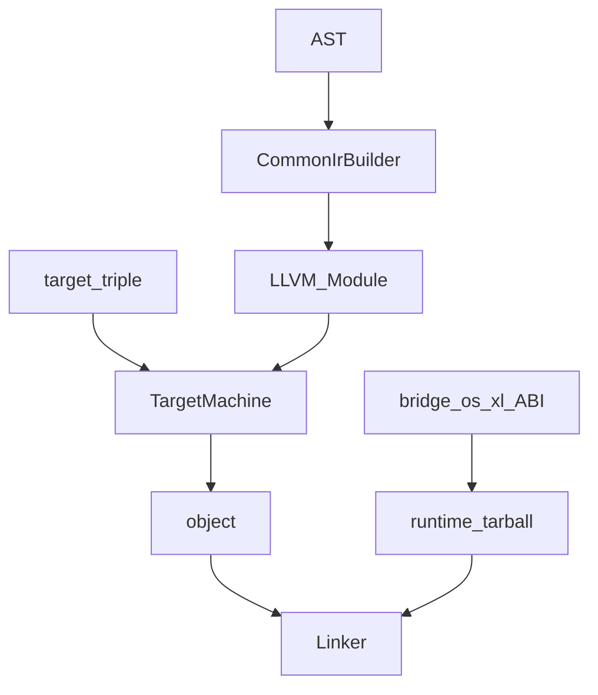

# Compiler + Runtime Full Rebuild

## Fixed decisions

- **Syscall / call paths (both required):**
  1. **Blind declare/call** — `declare external` / `declare syscall` → LLVM `declare`+`call`. No whitelist. `pthread_create`, `xl_thread_start`, user stubs… all the same: blind. Link/embed resolves symbols.
  2. **CPU-native syscall** — user can reach the **kernel directly** without runtime/system ABI. Codegen emits the native opcode for the target arch (`x86_64` → `syscall`, `aarch64` → `svc`, …). Number + args come from the user; the compiler does not validate or memorize OS syscall tables. Works with `--no-runtime`.
- **Bridge ABI naming (mandatory, xl helpers only):** `xl_<object>_<action>` — `xl_thread_start`, `xl_socket_connect`. Raw native syscalls and foreign symbols are not under this rule.
- **Codegen:** `AST → CommonIrBuilder → LLVM Module → TargetMachine(triple) → object`. No separate PlatformIrBuilder (does not emit OS IR). Platform tooling lives in `src/host` + `platform/*`; OS APIs live in runtime bridges.
- **OS work (bridges):** `bridge/linux|macosx|windows/`, with `thread.cpp` etc. and `#if` / arch defines for x86/x64. The same `xl_*` names are implemented on every OS.
- **Compiler:** Blindly compiles `declare`/`export`/`external`; **no** known-syscall list and **no** bridge `needs_*_link`. Link keeps two things: (1) target OS **baseline syslib flags** (`-lpthread`, etc.), (2) **static embed** of the runtime.
- **Link policy:** Prefer **static embedding** into the program (runtime + `xl_*` bridges + user `.a`). **External/shared link only for OS-provided syslibs** (pthread, libc, Win32 import libs, macOS system frameworks when needed). No default `.so`/`.dylib` for non-OS third parties — static `.a` or object.
- **Runtime:** Separate artifact; discovered automatically and **statically** linked. Tarball carries `RUNTIME_VERSION` + `SUPPORTED_COMPILERS`. Distribution: GitHub Releases (`os-arch-version`); package-manager CDN later.
- **Completion:** Nothing deferred to “later”; every item in this plan is implemented. Breakage is acceptable; compile-tests are not required.



---

## 1) Bridge / frontend audit (fix during implementation)

**Excess / wrong layer:**
- In-compiler pthread/net send-recv/atomic IR (`syscalls.cpp`) → move to bridges or delete.
- `cwd/chdir` in both filesystem and process → keep one place (process).
- Inconsistent `xlang_` prefixes → flat domain names (filesystem model).

**Gaps (minimum to close with OS bridge folders):**
- net: send/recv/close in the bridge (currently in IR).
- thread/sync primitives in the OS bridge (currently in IR).
- windows folder + stub/impl.

**Frontend:** Protocols (http) stay in xlang; bridges only expose `xl_*` userspace helpers.

---

## 1b) `xl_*` naming rule (normative)

| Rule | Correct | Incorrect |
|------|---------|-----------|
| Prefix `xl_` | `xl_thread_start` | `thread_start`, `xlang_thread_start` |
| `<object>_<action>` | `xl_socket_listen` | `xl_listen_socket`, `xl_start_thread` |
| Underscored domain | `xl_thread_start` | `xlthread_start` |
| Bridge ≠ raw syscall | `xl_thread_start` (helper) | compiler knowing kernel `clone` numbers |

Raw syscalls / user `declare` names are **not** under this rule (passthrough). Only the **runtime bridge C ABI + frontend declares bound to bridges** use `xl_*`.

Same table goes into docs + a cursor rule.

---

## 2) Two paths: blind declare + CPU-native syscall

**Mindset:** The compiler does not keep an OS API catalog. The user either uses a userspace ABI (`pthread` / `xl_*`) or enters the kernel via a **CPU-native syscall**.

### Path A — Blind declare/call
- `declare syscall` / `declare external` → plain `declare` + `call`.
- No name validation, no body emission.
- Examples: `pthread_create`, `xl_thread_start`, a symbol from your own `.o`.

### Path B — CPU-native syscall (I do not want the runtime)
- Language/codegen feature: user supplies syscall number + args; codegen emits the **native instruction** for the arch.
- `x86_64`: `syscall` · `aarch64`: `svc #0` · other archs in the target table.
- LLVM: inline asm or arch intrinsic — **CommonIrBuilder** takes the request; **Target/arch** picks the opcode (CPU trap, not OS-thread IR).
- Number/ABI contract is the user’s (Linux x86_64 numbers ≠ Windows). Compiler does not memorize them.
- Runtime embed is **optional** (`--no-runtime`); object + baseline syslibs if needed.

Removed old model: [`syscalls.cpp`](src/syscalls.cpp) whitelist + emitting pthread bodies in IR.

Docs/rule: “declare = blind call · native syscall = CPU trap → kernel · `xl_*` = optional helper.”

---

## 2b) OS baseline link flags + embed

**No flags derived from syscall use** — fixed baseline per target OS (or from the platform table):

| Target | Example baseline (minimum; platform module completes) |
|--------|--------------------------------------------------------|
| linux | `-pthread` (or `-lpthread`), `-ldl -lm` when needed |
| macosx | `-pthread`; system frameworks in the platform table if needed |
| windows | CRT / Win32 import libs in the platform table (`kernel32`, etc. as needed) |

- Tables live under `platform/{linux,macosx,windows}`; the compiler only asks `host/resolve` for “this target’s syslib flag list” and appends it to the link line.
- **Embed:** runtime package + bridge `.a` → **static** link into the executable. Shipped binary is as self-contained as possible; only OS syslibs remain external.
- User may pass extra `.o`/`.a` (also static). Non-OS shared libs are not supported/encouraged by default.
- `--no-runtime` remains an escape hatch; baseline OS flags for the target still apply.

---

## 3) Separate runtime build + version + static embed

**New xmake target(s):** `runtime` (or `runtime-<os>-<arch>`) — compile frontend + relevant OS bridge `.a` → tarball/package (static archives inside).

Plaintext at tarball root (UPPERCASE keys):

```text
RUNTIME_VERSION=0.1.0
SUPPORTED_COMPILERS=
0.1.0
0.1.1
0.2.0-0.3.0
```

- Local/dev: cwd `src/runtime`, flags / `XLANG_HOME`, xmake defines for override.
- Release: GitHub `owner/repo` release asset `xlang-runtime-{os}-{arch}-v{ver}.tar.gz`; compiler downloads/installs a compatible runtime.
- Link: compiler **statically embeds** the runtime artifact and adds target OS baseline syslib flags. It does not choose bridges via syscall analysis.

Cursor rule + docs: `RUNTIME.md` + `.cursor/rules/` — version format, embed policy, OS-only externals.

---

## 4) Backbone: replace `paths` with `src/host/`

Remove [`src/paths.cpp`](src/paths.cpp) / [`include/xlang/paths.h`](include/xlang/paths.h).

Example layout:

```text
src/host/
  resolve.cpp      # target os/arch, override flags
  layout.cpp       # user/root/cache dirs (via platform API)
  runtime_pkg.cpp  # read RUNTIME_VERSION, compatibility, install path
  fetch.cpp        # GitHub release download (via platform HTTP/FS)
platform/
  linux/*.cpp
  macosx/*.cpp
  windows/*.cpp
```

Core (`lexer`, `parser`, `ast`, common codegen) **does not know paths/OS**; `host` + `platform/*` supply that.

---

## 5) Platform abstraction

- Host resolve: current platform/arch; `--target` / `--arch` / xmake `XLANG_TARGET_*` overrides; cross downloads that runtime.
- Platform backend API (e.g.): `home_dir`, `path_join`, `lib_dirs`, `download`, `extract_tarball`, `exe_suffix`, `run_process`.
- Raw `fork`/`unistd` in [`src/compiler.cpp`](src/compiler.cpp) / [`src/test_runner.cpp`](src/test_runner.cpp) → platform process API.

---

## 6) Codegen (Common IR Builder + Target emit)

```text
include/xlang/codegen/
  builder.h     # CommonIrBuilder — language → LLVM IR (OS-agnostic)
  target.h      # triple, DataLayout, TargetMachine → object
```

Flow:
1. `CommonIrBuilder`: functions, blocks, arithmetic, blind `declare`/`call`, **native-syscall request** (number+args).
2. `TargetMachine` / arch hook: object emit + native syscall opcode selection (`syscall` / `svc` / …).

Remove the string `.ll` path; use the LLVM C++ API (+ inline asm when needed).

---

## 7) Bridge layout (OS × arch)

```text
src/runtime/bridge/
  linux/{filesystem,net,thread,process,time,panic}.c(pp)
  macosx/...
  windows/...
```

- xmake builds only host or `-p` target OS bridges; arch defines (`XLANG_ARCH_X64`, etc.).
- Frontend [`src/runtime/frontend/`](src/runtime/frontend/) is OS-agnostic; each OS bridge implements the same declare names.

Thread: `xl_thread_start` / `xl_thread_join` / … on every OS — no pthread in language IR.

---

## 8) Simplify AST + lexer

- [`src/lexer.cpp`](src/lexer.cpp) / [`include/xlang/lexer.h`](include/xlang/lexer.h): single pass, keyword table, escapes; no platform paths.
- [`src/ast.cpp`](src/ast.cpp) / [`include/xlang/ast.h`](include/xlang/ast.h): tagged union + factories; trim needless helpers.
- May break; user fixes. Compile-tests not required.

---

## 9) CLI / xmake

- Flags: `--target`, `--arch`, `--runtime`, `--runtime-version`, GitHub repo override.
- xmake defines: development (in-tree runtime) vs release (fetch).
- Separate targets: `xlang` (compiler C++ only) + `runtime` package.

---

## Implementation order (single pass, no interrupt)

1. Scaffold `src/host/` + `platform/{linux,macosx,windows}` (including syslib flag tables); migrate/remove `paths`.
2. Blind declare→call; CPU-native syscall emit; OS baseline link + runtime static embed.
3. Split bridges into OS folders; `xl_*` ABI; move thread/net I/O into bridges.
4. Separate runtime xmake package + `RUNTIME_VERSION` / `SUPPORTED_COMPILERS` + docs/rule (embed policy).
5. Codegen: CommonIrBuilder + TargetMachine; remove string `.ll`.
6. Cross/override + GitHub runtime fetch.
7. Simplify AST/lexer.
8. Finalize xmake/docs/cursor rules.
